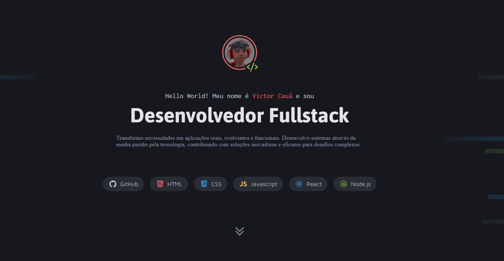

 
  
  

  ## 💻 Projeto
  Esse é um projeto de apresentação de perfil dev, com descrição de habilidades e outros trabalhos feitos.

  ## 🚀 Tecnologias 
  Esse projeto foi desenvolvido com as seguintes tecnologias:

  - HTML
  - CSS
  - Git e Github

  ## 🏷️ Layout
  Você pode visualizar o layout do projeto através [desse link](https://www.figma.com/design/ZkXsJVmd2sy10g6AreMZOf/Portfolio-Dev-(Community)?node-id=0-1&p=f&t=JHd8SISnOSKLatFt-0).
  É necessário ter uma conta no [Figma](https://www.figma.com).